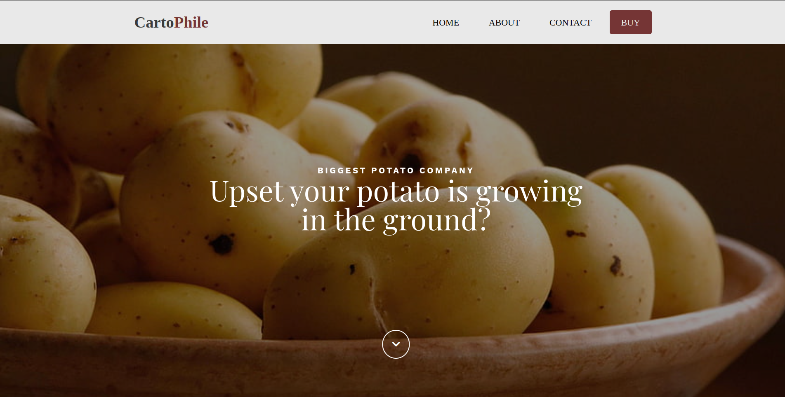
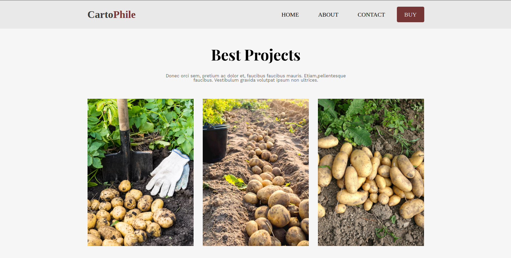

# CartoPhile

Welcome to CartoPhile, the home of the BIGGEST POTATO COMPANY. Ever been upset that your potato is growing in the ground? Fear not! We have managed to modify potatoes so they now grow on the ground. CartoPhile was created in 2018 with a fresh idea.

## Screenshots

### Header

### Projects

## Live Demo

Check out the live demo of CartoPhile [here](https://sexomq.github.io/WebPage-CartoPhile/).

## License

This project is licensed under the [MIT License](https://www.youtube.com/watch?v=dQw4w9WgXcQ).
